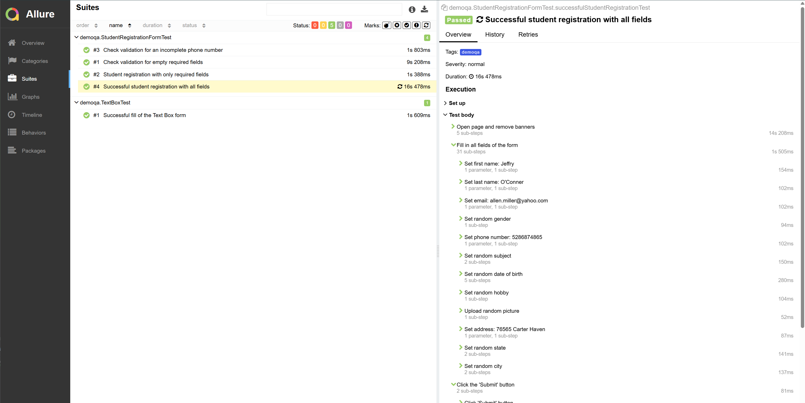

# UI Autotests Project for a Registration Form

[](https://www.java.com)
[](https://gradle.org)
[](https://junit.org/junit5/)
[](https://selenide.org/)
[](https://qameta.io/allure-framework/)

This project contains UI autotests to demonstrate filling out and verifying the student registration form on the DemoQA website.

**How the tests work:** each test opens the form page, fills in the fields (text fields, radio buttons, date pickers, file uploads, etc.) using randomly generated data, submits the form, and verifies that the correct data is displayed in the resulting modal window. The project also includes negative scenarios to check field validation.

---

## 🛠️ Tech Stack

| Purpose | Tool / Library |
| :--- | :--- |
| **Language** | `Java 11` |
| **Build Tool** | `Gradle` |
| **Test Framework** | `JUnit 5.10.0` |
| **UI Automation** | `Selenide 6.19.1` |
| **Test Data** | `JavaFaker 1.0.2` |
| **Reporting** | `Allure Framework 2.19.0` |

---

## 🚀 Getting Started

### Prerequisites

To run this project locally, you will need:

1.  **Java JDK 11** or higher.
2.  **IntelliJ IDEA** or any other IDE with Gradle support.
3.  **Git** to clone the repository.

### Installation

1.  Clone the repository to your machine:
    ```bash
    git clone [https://github.com/your-username/your-repository-name.git](https://github.com/your-username/your-repository-name.git)
    ```
2.  Open the project in your IDE. It will automatically detect the `build.gradle` file and download all the necessary dependencies.

---

## ✅ Running the Tests

You can run the tests in two ways:

### 1. Via the Terminal (using Gradle)

Open a terminal in the project's root folder and run the command:
```bash
./gradlew test
```
*For Windows, use `gradlew.bat test`*

### 2. Via IntelliJ IDEA

* Open the desired test class (e.g., `StudentRegistrationFormTest.java`).
* Click the green 'run' arrow next to the class or method name and select `Run '...Test'`.

---

## 📊 Viewing the Allure Report

### 1. Via the Terminal

After the tests have been executed, run the following command in the terminal to view the beautiful and interactive HTML report:
```bash
./gradlew allureServe
```
*For Windows, use `gradlew.bat allureServe`*

This command will start a local web server and automatically open the report page in your browser.

### 2. Via IntelliJ IDEA

1.  Open the **Gradle** tool window on the right side of the IDE.
2.  Navigate to `Your-Project-Name` -> `Tasks` -> `other` and double-click on the **`allureServe`** task.
3.  This will start the Allure server. Wait for the task to finish in the **Run** tool window at the bottom of the screen.
4.  In the console output of the Run window, find a line that says `Allure report was successfully served at http://...`. It will give you a local URL (e.g., `http://localhost:63342`).
5.  **Copy this URL and paste it into your web browser** to view the report.


